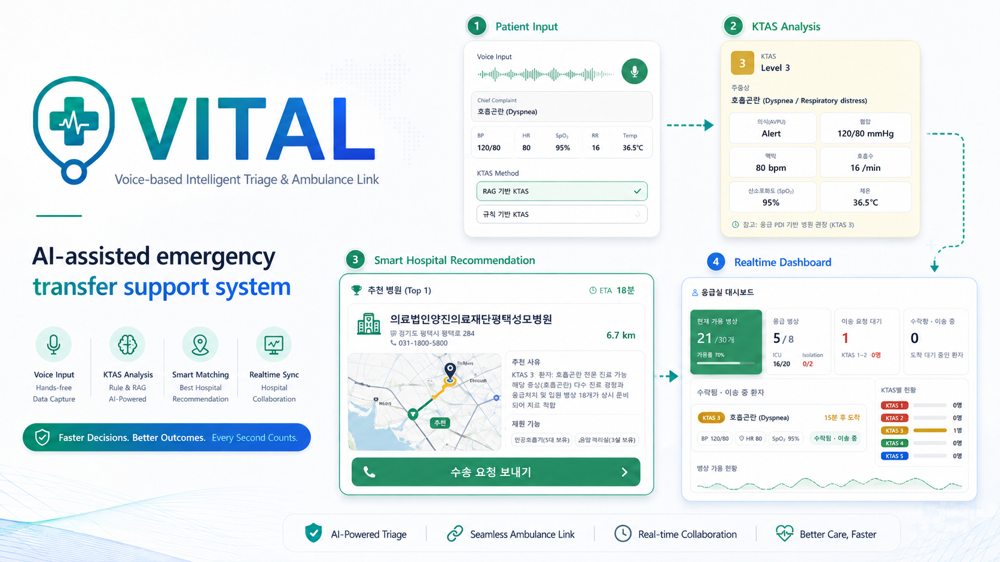

# VITAL

**Voice-based Intelligent Triage & Ambulance Link**



VITAL은 구급대원이 환자 상태를 음성 또는 텍스트로 입력하면 KTAS를 추정하고, 주증상과 위치/시군구 정보를 바탕으로 적합한 응급의료기관 후보를 추천하는 응급 이송 지원 시스템입니다.

이 프로젝트는 FastAPI 백엔드, React 프론트엔드, Supabase 연동, 응급의료기관 공개 API, Tmap 경로 API, KTAS rule-based/RAG-based 분류 흐름을 포함합니다.

## Documentation

프로젝트 설치 방법, API 명세, 예제 코드는 GitHub Wiki에서 확인할 수 있습니다.

- [Project Wiki](../../wiki)
- [API Reference](../../wiki/API-Reference)
- [Example Usage](../../wiki/Example-Usage)

실제 API key, Supabase service role key, access token, refresh token, 실제 환자 개인정보는 프론트엔드, README, Wiki, 브라우저 로그에 포함하지 않습니다.

## Key Features

- 음성 또는 텍스트 기반 KTAS 분석
- `rule_based` / `rag_based` KTAS 방식 선택
- RAG 실패 시 rule-based KTAS fallback
- KTAS 결과, 주증상, 위치/시군구 정보 기반 병원 후보 추천
- Tmap 기반 거리, ETA, 경로 좌표 조회
- Supabase Auth, Realtime, 이송 요청, 환자 케이스 저장 흐름
- 병원 대시보드와 응급실 태블릿 화면을 통한 이송 요청 상태 관리

## System Flow

1. 구급대원이 환자 상태, 활력징후, 현재 위치, 기존 진료 병원 정보를 입력합니다.
2. 백엔드가 텍스트 또는 음성을 SBAR 구조로 정리하고 KTAS를 계산합니다.
3. 프론트엔드는 KTAS 결과를 병원 추천 API로 전달합니다.
4. 백엔드는 주증상에 필요한 처치/시술 그룹과 실시간 병상 정보를 조합해 후보 병원을 필터링합니다.
5. 후보 병원은 거리/ETA로 보강되고, 선택된 병원에는 Supabase 기반 이송 요청이 생성됩니다.
6. 병원 화면은 Supabase Realtime으로 요청 상태를 확인하고 승인, 거절, 이송 중, 완료 흐름을 처리합니다.

## Core API

| Method | Endpoint | Purpose |
| --- | --- | --- |
| `POST` | `/api/ktas/predict-text` | 텍스트 기반 KTAS Stage 1 분석 |
| `POST` | `/api/ktas/predict-audio` | 음성 업로드 기반 KTAS Stage 1 분석 |
| `POST` | `/api/ktas/route/seoul` | KTAS 결과와 위치/시군구 정보 기반 병원 후보 추천 |
| `POST` | `/api/ktas/route/seoul/nearest` | 후보 병원 중 거리 기준 Top 3 계산 |
| `POST` | `/api/ktas/route/path` | Tmap 경로 좌표, 거리, ETA 조회 |

`/api/ktas/route/seoul`은 endpoint 이름에 `seoul`이 포함되어 있지만, 현재 구현은 사용자 위치, 시군구 코드/이름, 인접 시군구 확장을 활용해 병원 후보를 찾습니다. Endpoint path는 기존 코드와 호환성을 위해 그대로 유지합니다.

## Hospital Information API

| Method | Endpoint | Purpose |
| --- | --- | --- |
| `GET` | `/api/hospitals/realtime` | 지역별 실시간 응급실 병상 정보 |
| `GET` | `/api/hospitals/basic` | HPID 기준 병원 기본정보 |
| `GET` | `/api/hospitals/serious` | 지역별 중증질환 수용 가능 정보 |
| `GET` | `/api/hospitals/messages` | HPID 기준 응급/중증 메시지 |
| `GET` | `/api/hospitals/summary` | 단일 병원 통합 요약 |
| `GET` | `/api/hospitals/summary/by-region` | 지역별 병원 통합 요약 목록 |
| `GET` | `/api/hospitals/trauma/by-region` | 지역별 외상센터 정보 |
| `GET` | `/api/hospitals/complaint-coverage/by-region` | 병원별 지원 가능한 주호소 범주 |
| `GET` | `/api/hospitals/procedure-beds/by-region` | 지역별 처치/시술 group 병상 상태 |

## Legacy / Demo API

아래 API는 최신 KTAS routing 흐름과 구분되는 legacy, demo, development 용도입니다.

| Method | Endpoint | Purpose |
| --- | --- | --- |
| `POST` | `/api/triage/recommend` | legacy triage 기반 추천 |
| `POST` | `/api/triage/candidates` | legacy triage 기반 상세 후보 병원 조회 |
| `POST` | `/api/triage/reservations` | in-memory 병상 예약 데모 |
| `POST` | `/api/triage/reservations/release` | in-memory 병상 예약 해제 데모 |
| `GET` | `/debug/triage/pending-assignments` | in-memory 예약 상태 디버그 조회 |

Debug endpoint는 운영 환경에서 접근 제어 또는 비활성화가 필요합니다.

## Example Response

자세한 요청/응답 예시는 Wiki의 [Example Usage](../../wiki/Example-Usage)를 참고하세요. README에는 추천 결과의 형태만 짧게 표시합니다.

```json
{
  "case": {
    "ktas": 2,
    "complaint_label": "호흡곤란"
  },
  "hospitals": [
    {
      "id": "A0000000",
      "name": "Example Hospital",
      "total_effective_beds": 8,
      "coverage_level": "HIGH",
      "reason_summary": "KTAS 2 환자에게 필요한 처치 그룹과 가용 병상을 충족하는 후보 병원입니다."
    }
  ]
}
```

## Tech Stack

- Backend: Python 3.11, FastAPI, Pydantic, Poetry
- Frontend: React, Vite, TypeScript
- Database/Auth/Realtime: Supabase
- External APIs: 응급의료기관 공개 API, Tmap, Kakao
- AI/NLP: Whisper, OpenAI, rule-based KTAS, RAG-based KTAS

## Repository Structure

```text
app/       FastAPI backend, routing, KTAS, hospital recommendation logic
front/     React frontend and Supabase client integration
data/      region adjacency and KTAS RAG index data
scripts/   data export and sync utility scripts
tests/     backend and behavior tests
wiki_draft/ GitHub Wiki draft pages
```

## License

See [LICENSE.txt](LICENSE.txt).
